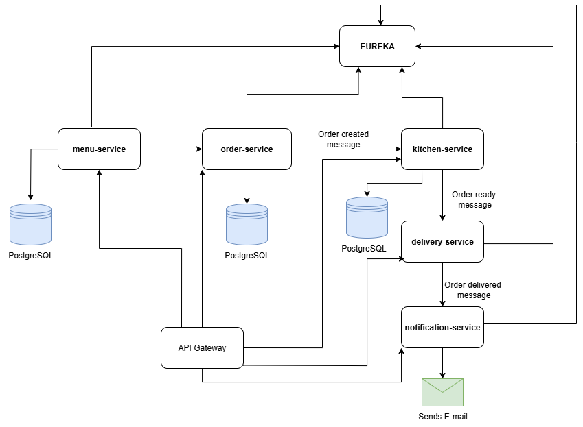

Sistem je zasnovan na arhitekturi mikrousluga i pokriva cijeli tok narucivanja hrane u restoranu – od izbora jela do isporuke i obavjestavanja korisnika. 
Svaka mikrousluga ima jasno definisanu ulogu i komunicira sa drugima sinhrono ili asinhrono (preko RabbitMQ). U nastavku su opisane glavne komponente sistema:

**MENU-SERVICE:**
	To je servis koji cuva i upravlja svim jelima i picima u restoranu.Cuvaju se podaci o tome koje jelo postoji, koliko kosta, da li je trenutno dostupno i 
koliko ga jos ima na zalihama. Podrzava osnovne CRUD operacije, pored toga omoguceno je pretrazivanje po kategorijama (dostupne kategorije: *FOOD*, *DRINK*, *DESSERT*), 
provjera da li je dostupno jedno ili više jela. Kada se napravi porudzbina, servis smanjuje zalihu za svako jelo koje je naruceno i ukoliko nesto nije na stanju 
korisnik dobije informaciju o tome da nije dostupno. Menu-service komunicira sa Order-service koji pravi porudzbinu, odnosno izmedju ova dva servisa je uspostavljena 
sinhrona komunikacija.

**ORDER-SERVICE:**
	Dio sistema koji omogucava korisniku da napravi i prati porudzbine u restoranu. Kada korisnik odabere jela i pošalje narudzbinu, 
Order-service prvo provjerava sa Menu-service da li ta jela postoje i da li ih ima na stanju. Ako je sve dostupno, rezervise ih, kreira porudzbinu sa statusom *CREATED*
i salje signal kuhinji da krene sa pripremom. Ako nesto nedostaje, porudzbina se odmah otkazuje i korisnik dobija obavestenje da artikli nisu dostupni. Osim kreiranja,
podrzava i ostale CRUD operacije. Nakon sto se porudzbina uspjesno kreira, servis prelazi na asinhronu komunikaciju – salje dogadjaje preko RabbitMQ koje dalje 
obradjuje Kitchen-service.

**KITCHEN-SERVICE:**
	Kitchen-service je dio sistema koji radi asinhrono: cim Order-service objavi dogadjaj da je porudzbina kreirana, kuhinja ga dobije preko reda poruka (RabbitMQ),
zabiljezi taj dogadjaj u svoju evidenciju, nasumicno dodjeli kuvara i simulira vrijeme pripreme (par sekundi) i zatim objavi novi dogadjaj *READY* kojim obavjestava 
druge servise da je porudzbina spremna. Pored toga, kuhinja cuva istoriju dogadjaja pa se preko jednostavnih API poziva moze vidjeti lista svih kuhinjskih dogadjaja 
ili dogadjaji za odredjenu porudžbinu.

**DELIVERY-SERVICE:**
      Delivery-service je servis za dostavu, koji radi u pozadini asinhrono. Kada kuhinja javi da je porudzbina spremna (dogadjaj *READY* stize na RabbitMQ),
Delivery-service je preuzme i kroz nekoliko koraka simulira dostavu: dodjeli kurira (*ASSIGNED*), preuzme porudzbinu (*PICKED_UP*), vozi ka korisniku (*IN_TRANSIT*) 
i na kraju je isporuci (*DELIVERED*). Po zavrsetku objavi novi dogadjaj *DELIVERED* na RabbitQM, kako bi ostatak sistema znao da je porudzbina stigla. 
Sve se odvija razmjenom poruka (*RabbitMQ*) bez direktnih REST poziva prema drugim servisima.

**NOTIFICATION-SERVICE:**
      Notification-service je dio koji obavjestava korisnika e-mailom kada je porudzbina isporucena. Radi u pozadini i asinhrono, cim Delivery-service objavi dogadjaj 
*DELIVERED* na RabbitMQ, Notification-service ga primi, sastavi jednostavnu poruku  i posalje je na e-mail korisniku.

**API Gateway:**
      Gateway je ulazna tacka sistema.
Korisnik (aplikacija, browser) ne mora da zna gdje se tacno nalazi Order-service, Menu-service i ostali – dovoljno je da sve zahtjeve salje na Gateway. 
On na osnovu adrese zna kome da proslijedi zahtjev. 

**EUREKA SERVER:**
	Eureka je dio Spring Cloud Netflix biblioteke i sluzi kao service discovery server.
U mikrouslugama, gdje ima vise servisa (Order, Menu, Kitchen, Delivery, Notification), svaki od njih se registruje u Eureku prilikom pokretanja. 
Na taj nacin, Eureka održava centralni imenik svih aktivnih instanci servisa.

# CI/CD Pipeline

GitHub Actions pipeline automatski pokrece **build** i **test** procese na svakom push-u na granama **main** i **develop**.

**Glavne faze:**
- Build (Kompajliranje/Dockerizacija): Automatski build svih servisa koristeci Maven i Docker. Svaki servis dobija svoju Docker sliku koja se cuva u GHCR 
(GitHub Container Registry).
- Test (Unit, Integration i ostali testovi):
	- Na main grani i tagovima pokrecu se svi testovi (unit + integration).
	- Na develop grani pokrecu se samo osnovni testovi.
- Docker integracija (Smoke test): Koristi docker-compose da podigne sve servise (Postgres, RabbitMQ, Eureka, Gateway i aplikacione servise) i 
provjeri da li sistem radi zajedno.
- Healthcheck: Provjerava da li je Gateway servis dostupan (/actuator/health) kako bi se potvrdilo da je kompletan sistem uspjesno pokrenut.

**Tehnologije:**
- GitHub Actions
- Java 17
- Maven
- Docker / Docker Compose
- GHCR (GitHub Container Registry)
- RabbitMQ, PostgreSQL 

**Pokretanje:**
Pipeline se automatski pokrece na:
- Push na main: build + svi testovi + smoke test + build i push Docker slika
- Push na develop: build + osnovni testovi (integration preskoceni) + smoke test + build i push Docker slika

